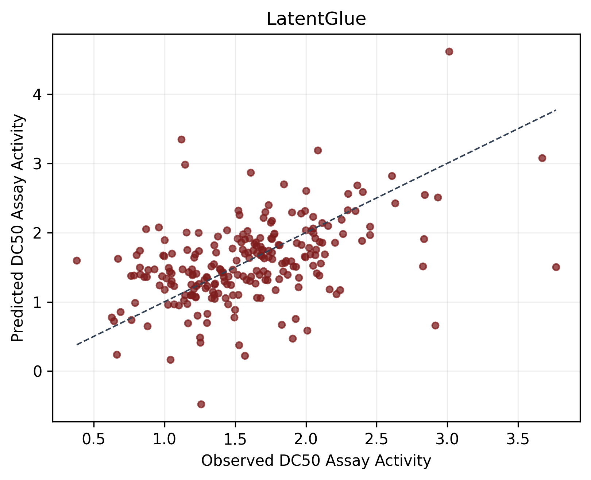
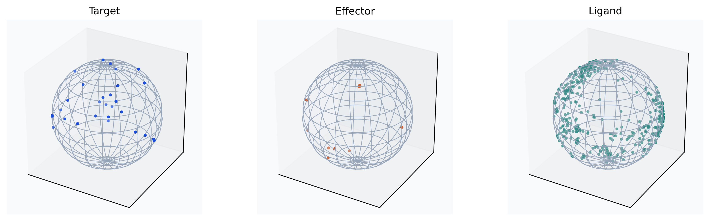
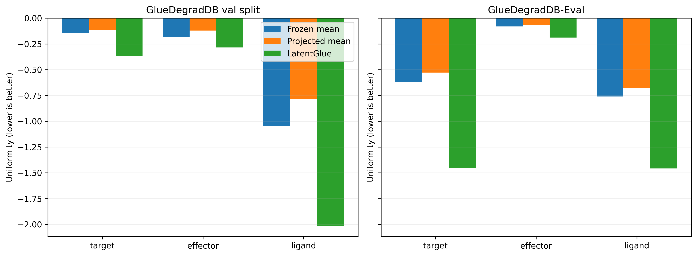

<h1 align="center">Learning General Representations of Molecular Glues in Isotropic Latent Space</h1>

<div align="center">

[](https://huggingface.co/datasets/ArnavSharma938/GlueDegradDB)
[](https://huggingface.co/datasets/ArnavSharma938/GlueDegradDB-Activity)
[](LICENSE)
[](https://latent-glue.vercel.app/)
[](https://huggingface.co/ArnavSharma938/LatentGlue)

</div>

<div align="center">
  <table style="border: none;">
    <tr>
      <td width="50%" valign="top" style="border: none;">
        
      </td>
      <td width="50%" valign="top" style="border: none;">
        
        <br>
        
      </td>
    </tr>
  </table>
</div>

> [!NOTE]
> **MIT License:**
> LatentGlue is freely available for **any use** under the MIT License, contributions are always welcome!<br><br>
> For any inquiries related to this project, contact **Arnav Sharma** at [arnavsharma.0914@gmail.com](mailto:arnavsharma.0914@gmail.com).

## Overview
LatentGlue is a 635 million-parameter self-supervised representation learning model for molecular glues. It uses frozen ESM-C protein features and frozen MoLFormer-XL ligand features, projects them into a shared 768-dimensional latent space, summarizes each component with seed-attention pooling, and is trained with masked latent reconstruction over target-effector-ligand ternaries in a concatenated complex.

- **Activity prediction:** On `GlueDegradDB-Activity`, LatentGlue achieves `RMSE = 0.575` and `Spearman = 0.468`, compared with `0.664 / 0.358` for the frozen-feature baseline (lower RMSE is better). This corresponds to a 13.4% reduction in RMSE and a 30.6% increase in Spearman relative to the baseline.
- **Effective dimensionality:** LatentGlue substantially expands the usable dimensionality of protein representations. LatentGlue's effective dimension increases from `300.2` to `528.5` and `212.6` to `499.0` for targets and effectors, respectively.

**Training to the released checkpoint (epoch 4) on a 4 vCPU, 32 GB RAM, 1× A100 80GB [Thunder Compute](https://www.thundercompute.com/) instance took under 60 minutes ($0.78). Open weights are available on [HuggingFace](https://huggingface.co/ArnavSharma938/LatentGlue).**

## Case Study

The case study applies LatentGlue to large-scale molecular glue screening, with the implementation in `src/casestudy/inference.py`. Starting from 104 million commercially accessible compounds from the [Enamine REAL database](https://enamine.net/compound-collections/real-compounds/real-database-subsets), the pipeline first performs chemistry-based filtering and then uses LatentGlue to screen and rank the top 10,000 candidate ligands for the Alpha-synuclein wild-type and KRAS G12D target contexts.

## Data
Available datasets include **[GlueDegradDB](https://huggingface.co/datasets/ArnavSharma938/GlueDegradDB)**, the training dataset; **[GlueDegradDB-Eval](https://huggingface.co/datasets/ArnavSharma938/GlueDegradDB-Eval)**, an evaluation set (separate from the validation split within GlueDegradDB, which has no component overlap); **[GlueDegradDB-Activity](https://huggingface.co/datasets/ArnavSharma938/GlueDegradDB-Activity)**, degradation profiles; and **[GlueDegradDB-Filter](https://huggingface.co/datasets/ArnavSharma938/GlueDegradDB-Filter)**, a 35M-molecule molecular glue degrader candidate set.

## Setup
Clone the repository

```powershell
git clone https://github.com/ArnavSharma938/LatentGlue.git
```

Create a virtual environment

```powershell
uv venv
.venv\Scripts\activate  # Windows
source .venv/bin/activate # Linux/macOS
```

Install dependencies

```powershell
uv pip install -r requirements.txt
```

Start training

```powershell
python scripts/run_train.py
```

> [!TIP]
> RDKit can be unstable on certain Linux distributions; accordingly, `scripts/run_processing.py` may fail in those environments. The full outputs from a verified run are provided directly in the `data/` directory and HuggingFace for immediate use.

## Citation
If you find this repository useful, please cite it as software while the paper is in peer review:

```bibtex
@software{sharma2026latentglue,
  author = {Sharma, Arnav},
  title = {Learning General Representations of Molecular Glues in Isotropic Latent Space},
  year = {2026},
  url = {https://github.com/ArnavSharma938/LatentGlue},
}
```
